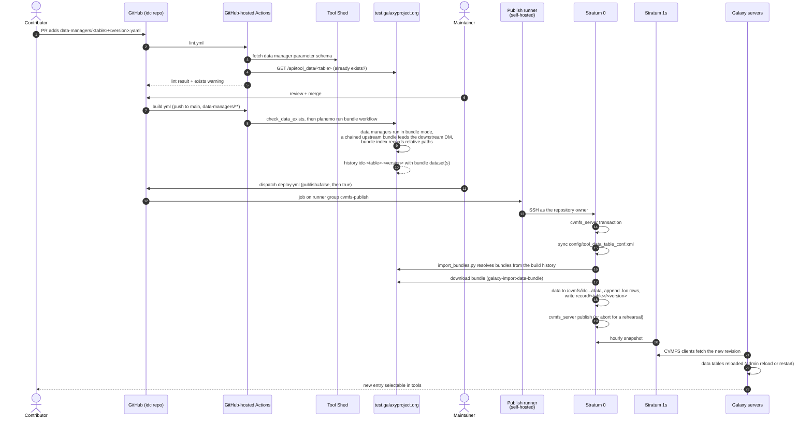

# How it works

How a versioned reference-data request travels from a pull request to a Galaxy
tool, for contributors and maintainers who want the whole picture. The
step-by-step for contributors is
[Requesting reference data](requesting-reference-data.md); the publish job is
described in [Publishing to CVMFS](cvmfs-publish-actions.md).

## The pieces

| piece | role |
|---|---|
| `data-managers/<table>/<version>.yaml` | one request: data manager `tool_id`, `params`, optional `depends_on` |
| `scripts/request_models.py` | the request schema and lint, including `params` against the Tool Shed's parameter schema |
| `scripts/generate_build.py` | turns a request into a gxformat2 data-manager-bundle workflow and a job file |
| `scripts/check_data_exists.py` | asks a Galaxy's public data table API whether the data is already served |
| `scripts/import_bundles.py`, `scripts/get_bundle_urls.py` | resolve a finished build's bundles and import them onto CVMFS |
| `.github/workflows/lint.yml` | Stage 1, on pull requests |
| `.github/workflows/build.yml` | Stage 2, on merge to `main` |
| `.github/workflows/deploy.yml` | Stage 3, dispatched by a maintainer |
| test.galaxyproject.org | the build Galaxy, and the reference for "does this exist?" |
| `idc.galaxyproject.org` | the CVMFS repository: Stratum 0 (where publishes happen) and Stratum 1 replicas (what clients read) |

## Contributor flow

A request is a single flat YAML file. Its **directory** is the data manager's
primary data table and must be one of its `data_tables`; its **file name** is
the version identity, which keys the build history (`idc-<table>-<version>`)
and the record marker on CVMFS (`record/<table>/<version>`). `tool_id` is a
version-pinned production Tool Shed GUID, and `params` are validated against the
parameter schema the Tool Shed serves for exactly that tool version.

The one rule that shapes everything else: **don't duplicate data a Galaxy
already serves.** The only "already exists" signal is the build Galaxy's public
data table API, which covers every source it loads; there is deliberately no
in-repo list of published versions.

## Maintainer flow

1. **Review.** Lint is green. The identity makes sense, and the `value` the data
   manager will write matches what other servers use for the same data (which is
   why the mOTUs request pins `db_value` to usegalaxy.eu's identifier). The data
   manager is installed on test and its jobs can run there.
2. **Merge.** `build.yml` starts by itself. `--no_use_cache` matters: without it
   Galaxy's job cache could hand back a copy of an earlier, possibly broken,
   bundle instead of running the data manager again.
3. **Watch the build.** Minutes for small databases, hours for large ones. Check
   the bundle by its index,
   `GET /api/datasets/<id>/display?filename=_gx_data_bundle_index.json`: paths
   must be relative and `value` as expected. (`display?preview=true` shows the
   data manager's primary output instead, with absolute job paths; it says
   nothing about the bundle.)
4. **Rehearse, then publish.** The publish workflow with `publish=false` does a
   full import into a CVMFS transaction and aborts it; its summary shows what
   would be imported and what skipped. Then run it with `publish=true`.
5. **Get it to users.** The Stratum 1s pick the new revision up on their hourly
   snapshot; Galaxy servers then reload the table or restart.
6. **Replacing an existing entry** isn't automated: it's a manual Stratum 0
   transaction (comment out the `.loc` row, remove the data directory and the
   `record/` marker), after which the normal publish imports the replacement.

## End to end

### Stage 1: Lint

`lint.yml`, on pull requests and pushes to `main`:

- `scripts/request_models.py` validates every request;
- `scripts/generate_schema.py --check --refresh` confirms the committed editor
  schema matches the model and what the Tool Shed serves;
- `scripts/generate_build.py --all` generates every build workflow and
  gxformat2-validates it;
- the unit tests run;
- `scripts/check_data_exists.py --all --warn` warns about data that already
  exists.

None of this needs secrets, so it runs safely on pull requests from forks.

### Stage 2: Build

`build.yml`, on a push to `main` that touches `data-managers/**`, or dispatched
by hand for one request. It runs with the build account's test.galaxyproject.org
key. `check_data_exists.py --print-new` drops requests whose data is already
served; for a chained request whose upstream is served, `generate_build.py`
references that entry instead of rebuilding it.

Each data manager runs with `__data_manager_mode: bundle` and writes a bundle
dataset: the data files plus `_gx_data_bundle_index.json`, which describes the
data table rows with paths relative to the bundle. In a chained build the
upstream step's bundle is wired straight into the downstream data manager's
input. `planemo run --no_wait` returns once the workflow is scheduled; the
build itself carries on in the history `idc-<table>-<version>`.

### Stage 3: Publish

`deploy.yml`, dispatched by a maintainer once the build histories are green.
It isn't triggered by the merge because the build finishes hours later and a
publish on merge would race it. It runs on a self-hosted runner, because the
Stratum 0 only accepts SSH from inside its own network, and uses credentials
held in a protected GitHub environment. The job opens a CVMFS transaction,
syncs `config/tool_data_table_conf.xml`, and for each request resolves the
bundles from its build history, refusing any dataset that isn't `ok`. A request
whose `record/<table>/<version>` marker exists is skipped, as is a chain's
upstream if its own marker exists. `galaxy-import-data-bundle` then moves the
data under `/cvmfs/idc.galaxyproject.org/data/` and appends the `.loc` rows, the
record marker is written, and the transaction is published (or aborted, for a
rehearsal). The Jenkins job runs the same code and remains a fallback.

### Stage 4: Distribution

The Stratum 1 replicas snapshot the Stratum 0 every hour, and CVMFS clients pick
up the new revision within minutes after that. A Galaxy server needs the IDC's
`tool_data_table_conf.xml` in its `tool_data_table_config_path`, its job
containers need `/cvmfs/idc.galaxyproject.org` bound in, and it has to reload
the table (or restart) before tools offer the new entry; see
[Using IDC data in Galaxy](using-idc-data.md).
<!-- TODO(merge post-publish-wait-and-reload): add that deploy.yml's
after-publish job waits for the Stratum 1s, then reloads and verifies the
tables on test.galaxyproject.org, and show it in the diagrams above. -->
