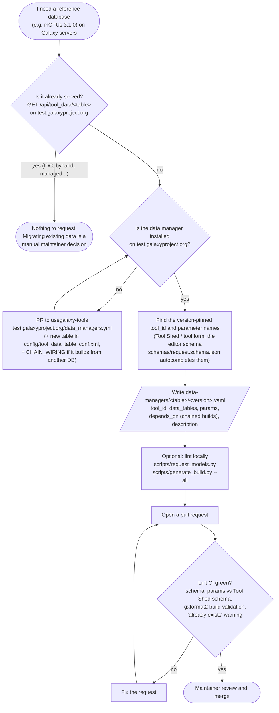
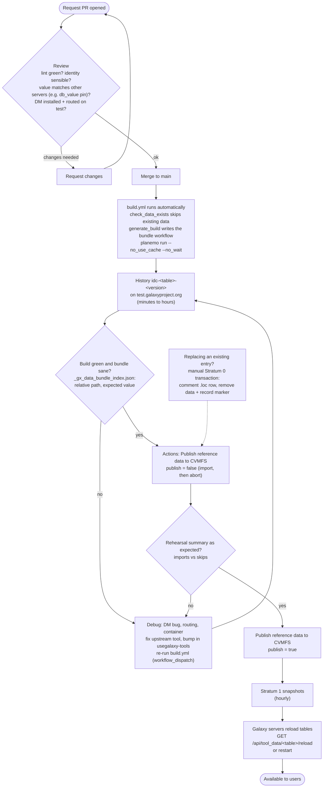
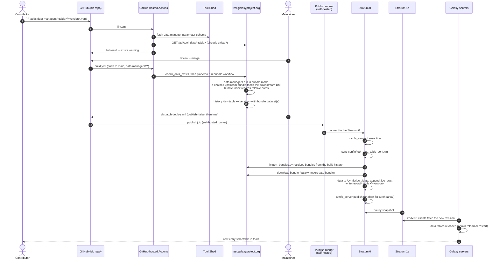

# How it works

This page follows a request from the pull request to a Galaxy tool. How to
write a request is covered in
[Requesting reference data](requesting-reference-data.md), and the publish job
in [Publishing to CVMFS](cvmfs-publish-actions.md).

## The pieces

| piece | role |
|---|---|
| `data-managers/<table>/<version>.yaml` | one request: data manager `tool_id`, `params`, optional `depends_on` |
| `scripts/request_models.py` | the request schema and lint, including `params` against the Tool Shed's parameter schema |
| `scripts/generate_build.py` | turns a request into a gxformat2 data-manager-bundle workflow and a job file |
| `scripts/check_data_exists.py` | asks a Galaxy's public data table API whether the data is already served |
| `scripts/import_bundles.py`, `scripts/get_bundle_urls.py` | resolve a finished build's bundles and import them onto CVMFS |
| `.github/workflows/lint.yml` | lint, on pull requests |
| `.github/workflows/build.yml` | build, on merge to `main` |
| `.github/workflows/deploy.yml` | publish, started by a maintainer |
| test.galaxyproject.org | the build Galaxy, and the reference for "does this exist?" |
| `idc.galaxyproject.org` | the CVMFS repository: Stratum 0 (where publishes happen) and Stratum 1 replicas (what clients read) |

## Contributor flow



The request's directory is the data manager's primary data table, and its file
name is the version identity, which names the build history
(`idc-<table>-<version>`) and the record marker on CVMFS
(`record/<table>/<version>`). Whether data already exists is decided by the
build Galaxy's public data table API, which covers every source that Galaxy
loads, so data that's already served somewhere isn't built again.

## Maintainer flow



Reviewers check that the lint is green, that the file name matches what the
data manager will write, and that the `value` matches what other servers use for
the same data, which is why the mOTUs request pins `db_value` to usegalaxy.eu's
identifier. The data manager has to be installed on test and able to run jobs
there.

The build starts by itself on merge. It runs planemo with `--no_use_cache`,
because Galaxy's job cache could otherwise hand back a copy of an earlier,
possibly broken, bundle instead of running the data manager again. Builds take
minutes for small databases and hours for large ones. A maintainer then checks
the bundle through its index,
`GET /api/datasets/<id>/display?filename=_gx_data_bundle_index.json`, where the
paths should be relative and `value` as expected. `display?preview=true` isn't
useful for this: it shows the data manager's primary output, which has absolute
job paths.

Publishing starts with a rehearsal (`publish=false`), which imports everything
into a CVMFS transaction and aborts it, and whose summary shows what would be
imported and what skipped. The real publish follows. Replacing an entry that's
already published isn't automated; a maintainer comments out the `.loc` row and
removes the data directory and the record marker in a Stratum 0 transaction,
and the next publish imports the replacement.

## End to end



### Lint

`lint.yml` runs on pull requests and on pushes to `main`. It validates every
request with `scripts/request_models.py`, checks with
`scripts/generate_schema.py --check --refresh` that the committed editor schema
still matches the model and the Tool Shed, generates and gxformat2-validates
every build workflow, runs the unit tests, and warns about requests whose data
already exists. It needs no secrets, so it runs on pull requests from forks.

### Build

`build.yml` runs on pushes to `main` that change `data-managers/`, and can be
started by hand for a single request. It drops requests whose data test already
serves, and for a chained request whose upstream is already served it uses that
entry instead of building it again. Each data manager runs in bundle mode and
writes the data together with `_gx_data_bundle_index.json`, which describes the
new rows with paths relative to the bundle. In a chained build, the upstream
step's bundle goes straight into the downstream data manager. planemo returns
once the workflow is scheduled, and the build carries on in the history
`idc-<table>-<version>`.

### Publish

`deploy.yml` is started by a maintainer once the builds are green, since they
finish hours after the merge. It runs on a self-hosted runner that can reach the
Stratum 0, with its credentials in a protected GitHub environment. The job opens
a CVMFS transaction, syncs `config/tool_data_table_conf.xml`, and resolves each
request's bundles from its build history, refusing datasets that aren't `ok`.
Requests that already have a record marker are skipped, and so is a chain's
upstream when it has one, so an upstream built both on its own and inside a
chain is imported once. `galaxy-import-data-bundle` moves the data under
`/cvmfs/idc.galaxyproject.org/data/` and appends the `.loc` rows, the record
marker is written, and the transaction is published, or aborted for a
rehearsal.

### Distribution

The Stratum 1 replicas take a snapshot of the Stratum 0 every hour, and CVMFS
clients see the new revision a few minutes later. A Galaxy server that loads the
IDC's `tool_data_table_conf.xml` then has to reload the table, or restart,
before its tools offer the new entry; see
[Using IDC data in Galaxy](using-idc-data.md).

### The list of data managers

`schemas/data_managers.yml` lists the data managers installed on the build
Galaxy, and the editor schema includes their parameters. When the installed set
changes in usegalaxy-tools, a maintainer refreshes both with

```bash
python scripts/generate_schema.py --from-lock https://raw.githubusercontent.com/galaxyproject/usegalaxy-tools/master/test.galaxyproject.org/data_managers.yml.lock
```

and commits the two files it rewrites.
<!-- TODO(merge post-publish-wait-and-reload): add that deploy.yml's
after-publish job waits for the Stratum 1s, then reloads and verifies the
tables on test.galaxyproject.org, and show it in the diagrams above. -->
