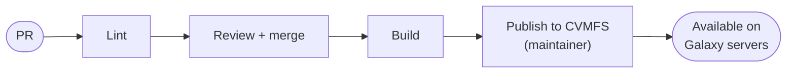

# Requesting reference data

Everything the IDC builds, from a MetaPhlAn database to a genome and its
Bowtie2 index, is produced by a Galaxy data manager and requested the same way:
a pull request that adds one YAML file describing which data manager to run and
with which parameters. The file is linted on the PR and built after the merge,
and a maintainer then publishes the result to the `idc.galaxyproject.org`
CVMFS repository, where any Galaxy server that mounts it can use it.

This page covers writing that file, checking it locally, and following it
through the pipeline afterwards. When in doubt, the request files already under
[`data-managers/`](https://github.com/galaxyproject/idc/tree/main/data-managers)
show what works. If you use a coding agent, the repository has
[skills](#using-an-agent) for the same steps.

## Before you start: does it already exist?

Don't request data that is already served. You can check with the data table
API of test.galaxyproject.org, which shows the IDC's data along with the other
galaxyproject.org reference data:

```bash
curl -s https://test.galaxyproject.org/api/tool_data/metaphlan_database_versioned
```

```json
{"name": "metaphlan_database_versioned",
 "columns": ["value", "name", "dbkey", "path", "db_version"],
 "fields": [["mpa_vOct22_CHOCOPhlAnSGB_202212-03042023", "MetaPhlAn clade-specific marker genes (mpa_vOct22_CHOCOPhlAnSGB_202212)", "mpa_vOct22_CHOCOPhlAnSGB_202212", "...", "SGB"],
            ...]}
```

If one of the rows has a field equal to your version (for MetaPhlAn that's
`dbkey`, for mOTUs `version`), or a `value` that is your version followed by
`-<date>`, the data is already there. If it's served by another repository and
you think it belongs in the IDC, open an issue; moving data is a maintainer
decision. A 404 means nobody has requested data from that data manager yet.

Search the open PRs as well
(`gh pr list --repo galaxyproject/idc --search "<table>"`) and the
[catalog](catalog.md) of existing requests.

## 1. Find the data manager

[`schemas/data_managers.yml`](https://github.com/galaxyproject/idc/blob/main/schemas/data_managers.yml)
lists the data managers you can request from, with their full tool GUIDs, so you
can usually copy `tool_id` from there:

```bash
grep -n metaphlan schemas/data_managers.yml
```

`tool_id` has to be a production Tool Shed GUID that ends in the tool version:

```
toolshed.g2.bx.psu.edu/repos/<owner>/<repo>/<tool id>/<tool version>
```

`<tool id>` and `<tool version>` are the `id=` and `version=` attributes of the
`<tool>` tag in the data manager's XML, which often differ from the repository
name. The lint rejects GUIDs without a version and GUIDs from the Test Tool
Shed. Note that the tool version isn't the database version: mOTUs'
`motus_db_fetcher/3.1.0+galaxy2` can also fetch mOTUs 3.0.1.

The data tables a data manager writes are the `<data_table name="...">` entries
in its repository's `data_manager_conf.xml`. The Tool Shed API tells you where
the repository's source lives:

```bash
curl -s 'https://toolshed.g2.bx.psu.edu/api/repositories?name=data_manager_motus&owner=bgruening'
```

If the data manager you need isn't listed, see
[Adding a new data manager](#adding-a-new-data-manager).

## 2. Name the file

A request lives at `data-managers/<data_table>/<version>.yaml`.

The directory is the data manager's primary data table, the one tools pick the
data from, and it has to be one of the request's `data_tables`. The file name is
the version identity and has to be unique within the table.

Use the name the data manager itself gives the data, such as MetaPhlAn's index
name (`mpa_vJan21_CHOCOPhlAnSGB_202103`) or the mOTUs release (`3.1.0`). The
pipeline recognises published data by finding the file name, a `params` value
or a `depends_on` version in the data table row, either as a whole field or as
the start of `value` followed by `-`. To see whether that works for your
request, run the existence check against a server that already has the same
data, e.g.
`python scripts/check_data_exists.py --reference-galaxy https://usegalaxy.eu <file>`.

Data without a version of its own, like whatever BLAST `nr` is on the day it's
downloaded, gets a date: `nr_2026-09-21`, with a `description` saying what the
date means. Such a data manager is typically requested with `params: {}`; the
date in the file name is what tells one build from the next. A database built
from another one names its source, as in `marker_db_motus_3.1.0` for SameStr
built from mOTUs 3.1.0.

The name ends up in history names, paths and shell commands, so stick to
letters, digits, `.`, `_` and `-`.

## 3. Fill in the parameters

`params` holds the data manager's own tool parameters, keyed by the `name=` of
its `<param>` tags and nested the way the tool form nests them, so a
`<conditional name="db_source">` containing `db_type` becomes
`db_source: {db_type: motus}`.

The lint checks `params` against the parameter schema the Tool Shed publishes
for that exact tool version, and its error messages list the names or values the
tool does accept. To look at the schema yourself:

```bash
python scripts/tool_schemas.py toolshed.g2.bx.psu.edu/repos/bgruening/data_manager_motus/motus_db_fetcher/3.1.0+galaxy2
```

The output includes the options of every select, the defaults and the help
text, and leaves out hidden parameters, which a request can't set.

If you start the file with

```yaml
# yaml-language-server: $schema=https://raw.githubusercontent.com/galaxyproject/idc/main/schemas/request.schema.json
```

VS Code (with the Red Hat YAML extension) and JetBrains IDEs complete and check
`params` as you type.

### Matching another server's identifier

The `value` column of a data table is what workflows and tool runs refer to. If
another Galaxy, usegalaxy.eu say, already has the same data, the IDC should
write the same `value`, or a workflow built there won't find its data here:

```bash
curl -s https://usegalaxy.eu/api/tool_data/motus_db_versioned
```

Some data managers let you set `value` directly. The mOTUs one has a `db_value`
parameter, and the mOTUs request uses it to write usegalaxy.eu's identifier:

```yaml
params:
  version: "3.1.0"
  db_value: "db_from_2026-04-27T094930Z"
```

Nothing in the pipeline treats `db_value` specially; it's an ordinary tool
parameter. If a data manager has no such parameter and would write a different
`value`, mention it in the PR. The IUC guide on
[stable data table identifiers](https://galaxy-iuc-standards.readthedocs.io/en/latest/best_practices/data_managers.html#stable-data-table-identifiers)
describes what new data managers should write.

## 4. Databases built from other databases

Some data managers take another database as input: SameStr builds its marker
database from a MetaPhlAn or an mOTUs database, and a Bowtie2 index is built from
a genome in `all_fasta`. Such a request names what it's built from with
`depends_on`, mapping the upstream table to the upstream request's file name:

```yaml
depends_on:
  motus_db_versioned: "3.1.0"
```

A request file for the upstream has to exist, and if the upstream version is new
too, both files go in the same PR. If the upstream is already served, the build
uses it; otherwise it's built first, in the same workflow.

`depends_on` also decides which input of the downstream tool the upstream goes
into. `CHAIN_WIRING` in
[`scripts/generate_build.py`](https://github.com/galaxyproject/idc/blob/main/scripts/generate_build.py)
maps each pair of downstream and upstream table to the tool's conditional and
input, which is why SameStr requests have `params: {}` even though the tool has
a `db_source` conditional. A pair that isn't in `CHAIN_WIRING` yet needs an
entry added in the same PR, and the lint says so.

## 5. Write the file

| field | required | |
|---|---|---|
| `tool_id` | yes | version-pinned production Tool Shed GUID of the data manager |
| `data_tables` | yes | the tables the data manager writes, including the directory name |
| `params` | no | the tool's parameters for this build |
| `depends_on` | no | `{upstream_table: upstream_version}` for a database built from another |
| `description` | no | what the data is, for reviewers and the catalog |
| `doi` | no | DOI of the publication or dataset |

Any other field is an error. Here is the mOTUs request,
[`data-managers/motus_db_versioned/3.1.0.yaml`](https://github.com/galaxyproject/idc/blob/main/data-managers/motus_db_versioned/3.1.0.yaml):

```yaml
# yaml-language-server: $schema=https://raw.githubusercontent.com/galaxyproject/idc/main/schemas/request.schema.json
# mOTUs database v3.1.0 (fetched from Zenodo record 7778108).
# Standalone build: the data manager downloads the DB by version.
tool_id: toolshed.g2.bx.psu.edu/repos/bgruening/data_manager_motus/motus_db_fetcher/3.1.0+galaxy2
data_tables:
  - motus_db_versioned
params:
  version: "3.1.0"   # the tool's "Database Version" select param
  # "Database identifier override": the exact `value` the tool writes to the data
  # table. Set to usegalaxy.eu's existing identifier so workflows built there
  # resolve here unchanged (left empty, the tool would stamp today's date).
  db_value: "db_from_2026-04-27T094930Z"
description: mOTUs profiler database, version 3.1.0
```

and the SameStr database built from it,
[`data-managers/samestr_db/marker_db_motus_3.1.0.yaml`](https://github.com/galaxyproject/idc/blob/main/data-managers/samestr_db/marker_db_motus_3.1.0.yaml):

```yaml
# yaml-language-server: $schema=https://raw.githubusercontent.com/galaxyproject/idc/main/schemas/request.schema.json
# SameStr marker database built from the mOTUs 3.1.0 database.
# Chained build: samestr's "motus_db" input is backed by the motus_db_versioned
# data table, so the build workflow first runs the mOTUs data manager (bundle
# mode) and feeds its output into this step.
tool_id: toolshed.g2.bx.psu.edu/repos/iuc/data_manager_samestr/samestr_db/1.2025.111+galaxy4
data_tables:
  - samestr_db
depends_on:
  # Which mOTUs version this SameStr DB is built against. A request file must
  # exist at data-managers/motus_db_versioned/<version>.yaml.
  motus_db_versioned: "3.1.0"
# Empty on purpose: the tool's db_source conditional is not steered from here.
# depends_on names the upstream table, and CHAIN_WIRING in generate_build.py maps
# (samestr_db, motus_db_versioned) -> db_source: {db_type: motus} plus the input
# that receives the bundle, so the non-default branch is selected by the
# dependency itself. params is for a build's own tool parameters - see
# data-managers/motus_db_versioned/3.1.0.yaml for an example that uses it.
params: {}
description: SameStr marker database derived from mOTUs 3.1.0
```

Quote version numbers (`"3.1.0"`) so YAML keeps them as strings. For genomes and
their indexes, see [Genomes](genome-indexing.md).

## 6. Check it locally

CI runs these on the PR, but running them first saves a round trip. In a
virtualenv, from a checkout of this repository:

```bash
pip install "pydantic>=2" pyyaml jsonschema gxformat2 pytest

python scripts/request_models.py <files>
python scripts/generate_schema.py --check
python scripts/generate_build.py <files> --outdir build
python scripts/check_data_exists.py <files>
```

`request_models.py` validates the request itself, including `params` against
the tool's schema. Without arguments it lints every request; `--no-fetch` keeps
it from asking the Tool Shed and `--no-tool-schemas` skips the `params` check.

`generate_schema.py --check` reports the editor schema as stale when your
request uses a `tool_id` it doesn't know. Run `python scripts/generate_schema.py`
and commit the updated `schemas/request.schema.json` with the request.

`generate_build.py` writes `build/<table>/<version>/workflow.gxwf.yml` and
`job.yml`, the workflow and inputs the build will run after the merge, and
validates the workflow with gxformat2.

`check_data_exists.py` prints `No requested reference data already exists on
...` if the data isn't served yet. It exits 1 if it is, or if the server didn't
answer (`cannot tell whether this already exists`), in which case try again
later.

CI additionally runs `generate_schema.py --check --refresh`, the unit tests and
`generate_build.py --all`.

## 7. Open the pull request

Open one PR per request, or one for a new upstream together with what's built
from it. The description should say what the data is and where it comes from,
why it's needed, that you checked it isn't served yet, which server's identifier
it matches if you pinned `value`, and how large the download and how long the
build are if you know. Reviewers plan publishes around builds that take hours.

## After the merge



Merging starts the build, which takes minutes for small databases and hours for
large ones. When it's done, a maintainer checks the result and publishes it to
CVMFS; see [Publishing to CVMFS](cvmfs-publish-actions.md). Galaxy servers that
use the IDC see new data within about an hour of the publish, once the CVMFS
replicas have updated and the server has reloaded its data tables.
[How it works](architecture.md) describes each stage in detail.

## Checking on a request

None of this needs a Galaxy API key.

| stage | how to check |
|---|---|
| lint | the PR's checks, or `gh pr checks <number> --repo galaxyproject/idc` |
| build started | the *Build reference-data bundles* run for the merge (`gh run list --repo galaxyproject/idc --workflow build.yml`). Its "Select requests to build" step lists what it built and what it skipped. |
| build finished | ask on the PR |
| published | `curl -s https://test.galaxyproject.org/api/tool_data/<table>` shows the row, or `python scripts/check_data_exists.py --expect-exists <file>` prints `ok: <table>/<version> is present` |

## Adding a new data manager

A data manager that isn't in `schemas/data_managers.yml` has to be installed
first, by adding it to
[usegalaxy-tools](https://github.com/galaxyproject/usegalaxy-tools)'
[`test.galaxyproject.org/data_managers.yml`](https://github.com/galaxyproject/usegalaxy-tools/blob/master/test.galaxyproject.org/data_managers.yml).
The lint here works before that's merged, but the build doesn't.

In this repository, its data tables go in
[`config/tool_data_table_conf.xml`](https://github.com/galaxyproject/idc/blob/main/config/tool_data_table_conf.xml),
reading from `/cvmfs/idc.galaxyproject.org/config/<table>.loc`, with the columns
of the data manager's `tool_data_table_conf.xml.sample` and
`allow_duplicate_entries="False"`. If it's built from another database, it needs
a `CHAIN_WIRING` entry naming the conditional to set (if any) and the input that
receives the upstream bundle. The table, the wiring and the first request can
share a PR. Regenerate the editor schema with
`python scripts/generate_schema.py` and commit it too.

## Lint errors

**`tool_id must be a production Tool Shed GUID starting with 'toolshed.g2.bx.psu.edu/repos/'`**

The GUID is from the Test Tool Shed or misspelled.

**`tool_id must be a version-pinned GUID host/repos/owner/repo/tool/version`**

The tool version is missing from the end, e.g. `/3.1.0+galaxy2`.

**`params: Additional properties are not allowed ('version' was unexpected); this tool's parameters here are ['index']`**

The tool has no parameter of that name at that level. The message lists the ones
it has; nested parameters go inside their section or conditional.

**`params: index: 'mpa_vJan25_CHOCOPhlAnSGB_2025' is not one of [...]`**

A select only accepts the options the tool offers, and the message lists them.
If the version you need isn't among them, the data manager has to be updated
first, or you have an older tool version pinned.

**`cannot check params - no parameter schema for tool_id ...`**

The Tool Shed has no schema for that GUID, usually because the tool id or
version is wrong. `python scripts/tool_schemas.py <GUID>` shows the same error.

**`Extra inputs are not permitted`**

A field that isn't in the table under [Write the file](#5-write-the-file). There
is no `version` field; the version is the file name.

**`directory name 'motus_db' is not in data_tables ['motus_db_versioned']`**

The directory has to be named after the primary data table.

**`depends_on ... but no request file exists at data-managers/<table>/<version>.yaml`**

Add the upstream request, or correct the version to an existing request's file
name.

**`No chain wiring defined for downstream ...`**

The pair needs a `CHAIN_WIRING` entry; see
[Adding a new data manager](#adding-a-new-data-manager).

**`error: schemas/request.schema.json is stale`**

Run `python scripts/generate_schema.py` and commit the result. If CI reports
this but the local `--check` passes, the Tool Shed has changed a schema already
in use, and `python scripts/generate_schema.py --refresh` picks that up.

## Other questions

**The lint warns that my data already exists.** It's already served from some
source. If the existing entry is wrong or should move into the IDC, say so on
the PR; replacing an entry is done by hand by a maintainer.

**The PR is merged but nothing was built.** The build run's "Select requests to
build" step says which requests it skipped and why. A maintainer can re-run the
build for a single request once a failure is fixed.

**It's published, but my Galaxy doesn't show it.** Give it up to an hour, then
reload the table on that Galaxy or restart it. The server also has
to load the IDC's `tool_data_table_conf.xml`; see
[Using IDC data in Galaxy](using-idc-data.md).

**Can I request a new version of something the IDC already has?** Yes, a new
version is a new file. Requesting the same file name again does nothing.

## Using an agent

Coding agents working in the repository can follow two skills, described in
[`AGENTS.md`](https://github.com/galaxyproject/idc/blob/main/AGENTS.md).
`request-reference-data` goes from "I need database X, version Y" to a linted
request and a drafted PR, and `check-reference-data-request` finds out how far a
request has got. Both use the scripts described on this page and neither needs
an API key.
