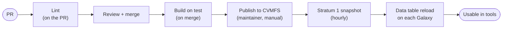

# Requesting reference data

Beyond the genome indexes built from `genomes.yml`, the IDC builds **versioned
reference databases** with Galaxy data managers: MetaPhlAn, mOTUs and SameStr so
far, and any other data manager installed on the build Galaxy. You ask for one by
opening a pull request that adds a single YAML file. CI lints it. Merging builds
it on [test.galaxyproject.org](https://test.galaxyproject.org) as a Galaxy
*data-manager bundle workflow*, and a maintainer then publishes the result to the
`idc.galaxyproject.org` CVMFS repository, from which every Galaxy server that
mounts it can use it.

This guide walks through a request from "I need database X, version Y" to a merged
PR, and what happens after that. The real request files under
[`data-managers/`](https://github.com/galaxyproject/idc/tree/main/data-managers)
are the source of truth if this page ever drifts from them.

**In short:**

1. Check the data isn't already served ([below](#before-you-start-does-it-already-exist)).
2. Find the data manager's version-pinned `tool_id` and its data table.
3. Pick the version identity: the file name.
4. Fill in `params`, checked against the tool's own parameter schema.
5. For a database built from another one, add `depends_on`.
6. Write `data-managers/<data_table>/<version>.yaml` and lint it locally.
7. Open the PR.

If you work with a coding agent (Claude Code, Codex, ...), the repository ships
skills that walk it through the same steps: see
[Using an agent](#using-an-agent).

## Before you start: does it already exist?

Don't request data a Galaxy already serves. The only "does this exist?" signal
is the build Galaxy's public data table API, which lists what is actually
available there from *every* source: IDC, the byhand `data.galaxyproject.org`
repository, and the other CVMFS repositories test.galaxyproject.org loads.
There is deliberately no in-repo list of published versions.

```bash
curl -s https://test.galaxyproject.org/api/tool_data/metaphlan_database_versioned
```

```json
{"name": "metaphlan_database_versioned",
 "columns": ["value", "name", "dbkey", "path", "db_version"],
 "fields": [["mpa_vOct22_CHOCOPhlAnSGB_202212-03042023", "MetaPhlAn clade-specific marker genes (mpa_vOct22_CHOCOPhlAnSGB_202212)", "mpa_vOct22_CHOCOPhlAnSGB_202212", "...", "SGB"],
            ...]}
```

- A row whose `value` or version column names your version means the data is
  there: there is nothing to request. Moving data that another repository
  already serves (byhand, say) into the IDC is a maintainer decision, not a
  request; open an issue instead.
- A 404 means the table isn't configured on test at all, which is normal for a
  data manager nobody has requested from yet (see
  [Adding a brand-new data manager](#adding-a-brand-new-data-manager)).
- Also look for an open PR already asking for it:
  `gh pr list --repo galaxyproject/idc --search "<table> in:title,body"`, and at
  the [catalog](catalog.md) of existing requests.

Once your request file exists, `scripts/check_data_exists.py <file>` runs the
same check against your exact request (see [Lint locally](#6-lint-locally)).

## 1. Find the data manager and its `tool_id`

The data manager has to be installed on test.galaxyproject.org first. The
installed set is
[`test.galaxyproject.org/data_managers.yml`](https://github.com/galaxyproject/usegalaxy-tools/blob/master/test.galaxyproject.org/data_managers.yml)
in usegalaxy-tools, and this repository's
[`schemas/data_managers.yml`](https://github.com/galaxyproject/idc/blob/main/schemas/data_managers.yml)
lists it resolved to full tool GUIDs, so usually you can copy the GUID from
there:

```bash
grep -n metaphlan schemas/data_managers.yml
```

If yours isn't installed, start with
[Adding a brand-new data manager](#adding-a-brand-new-data-manager).

`tool_id` is the full, **version-pinned**, **production** Tool Shed GUID:

```
toolshed.g2.bx.psu.edu/repos/<owner>/<repo>/<tool id>/<tool version>
```

`<tool id>` and `<tool version>` are the `id=` and `version=` attributes of the
`<tool>` tag in the data manager's XML, not the repository name. The lint
rejects a GUID without the trailing version (a build must be reproducible) and
anything from the Test Tool Shed. The repository and its owner are searchable on
the Tool Shed, and `remote_repository_url` in the answer points at the source:

```bash
curl -s 'https://toolshed.g2.bx.psu.edu/api/repositories?name=data_manager_motus&owner=bgruening'
```

The data manager's **data table(s)** are the `<data_table name="...">` entries in
the repository's `data_manager_conf.xml`. List all of them in `data_tables`. If
there is more than one, the *primary* table is the one tools select this
database from; it names the request's directory.

## 2. Choose the version identity (the file name)

A request lives at

```
data-managers/<data_table>/<version>.yaml
```

- **`<data_table>`** is the data manager's primary data table, e.g.
  `motus_db_versioned`. It must be one of the file's `data_tables`; the lint
  checks this.
- **`<version>`** (the file name without extension) is the *version identity*.
  It names the build history on test (`idc-<data_table>-<version>`) and the
  marker the publish writes on CVMFS (`record/<data_table>/<version>`), which is
  what makes re-running a publish safe. It must be unique within the table.

Rules of thumb:

- **Use the identity the data manager itself uses**, so it can be found in the
  data table afterwards: MetaPhlAn's index name
  (`mpa_vJan21_CHOCOPhlAnSGB_202103`), mOTUs' release (`3.1.0`). The existence
  check matches the file name, the `params` values and the `depends_on`
  versions against every column of the table (and against `value` followed by
  a `-<suffix>`, which covers data managers that append a download date), so an
  identity that appears nowhere in the row the data manager writes is never
  recognised as built.
- **Unversioned upstream data gets a date.** BLAST `nr`, say, is simply whatever
  was current when it was fetched: name the request `nr_2026-09-21` and say what
  that means in `description`. The data manager doesn't need a version
  *parameter* for this: an unparameterised "fetch the current release" data
  manager is requested with `params: {}`, and the date in the file name is what
  tells one build from the next.
- **Derived databases name what they are derived from**, e.g.
  `samestr_db/marker_db_motus_3.1.0` for SameStr built from mOTUs 3.1.0.
- Keep to letters, digits, `.`, `_` and `-`: the name ends up in a history
  name, a path on CVMFS and shell commands.
- Use the `.yaml` extension (`.yml` works too).

## 3. Fill in `params`

`params` are the data manager's own tool parameters for this build, keyed by the
`name=` of its `<param>` tags and nested like the tool form: a
`<conditional name="db_source">` holding `db_type` is written
`db_source: {db_type: motus}`. Each one becomes an input of the generated
workflow.

The Tool Shed publishes every tool version's parameter schema, and the lint
checks `params` against it: a name the tool doesn't have, a select value it
doesn't offer or a value of the wrong type fails the PR, with the allowed names
or values in the message. To see what a tool accepts, ask by its GUID:

```bash
python scripts/tool_schemas.py toolshed.g2.bx.psu.edu/repos/bgruening/data_manager_motus/motus_db_fetcher/3.1.0+galaxy2
```

The select options (`const` values), defaults and help text are in there.
Parameters a contributor can't set (hidden ones) are already stripped.

**Editors get the same thing live.** Start every request file with

```yaml
# yaml-language-server: $schema=https://raw.githubusercontent.com/galaxyproject/idc/main/schemas/request.schema.json
```

VS Code (with the Red Hat YAML extension) and JetBrains IDEs then complete and
check `params` names and values for every data manager installed on the build
Galaxy, plus every `tool_id` already used by a request.
[`schemas/request.schema.json`](https://github.com/galaxyproject/idc/blob/main/schemas/request.schema.json)
is generated; see [Lint locally](#6-lint-locally) for when to regenerate it.

### Pinning the identifier: `db_value`

What ends up in the data table's `value` column is the identifier workflows and
tool runs refer to. If another Galaxy (usegalaxy.eu, say) already serves the
same data under some identifier, the IDC should write the *same* one, so a
workflow built there runs here unchanged.

Some data managers stamp the install date into `value`
(`db_from_2026-07-12T140418Z`) even though the data is a fixed release. The mOTUs
data manager fetches a fixed Zenodo record but used to do exactly that, so two
servers would have had different identifiers for byte-identical data. Its current
release has a `db_value` parameter that sets `value` explicitly, and the mOTUs
request uses it to write the identifier usegalaxy.eu already has:

```yaml
params:
  version: "3.1.0"
  db_value: "db_from_2026-04-27T094930Z"
```

It is an ordinary tool parameter; nothing in the pipeline treats it specially.
To find another server's identifier, query its data table the same way
(`curl -s https://usegalaxy.eu/api/tool_data/motus_db_versioned`). New data
managers shouldn't need such a knob: the IUC guide on
[stable data table identifiers](https://galaxy-iuc-standards.readthedocs.io/en/latest/best_practices/data_managers.html#stable-data-table-identifiers)
asks for the data's own version in `value` and for install-time provenance to
stay out of it.

## 4. Chained builds: `depends_on`

Some data managers build from another database: SameStr builds its marker
database from a MetaPhlAn or an mOTUs database. Such a request names the
upstream table and version:

```yaml
depends_on:
  motus_db_versioned: "3.1.0"
```

- A request file for the upstream **must exist**
  (`data-managers/motus_db_versioned/3.1.0.yaml`), so the build can produce it
  if it isn't there yet. If you need a new upstream version too, add both files
  in the same PR.
- If the upstream already exists on test, the build references that entry
  instead of rebuilding it (it looks the upstream up by its version column). If
  it doesn't, the upstream data manager runs first, in the same workflow, and its
  bundle feeds the downstream one.
- The upstream **branch** of the tool is selected by `depends_on`, not by
  `params`. `CHAIN_WIRING` in
  [`scripts/generate_build.py`](https://github.com/galaxyproject/idc/blob/main/scripts/generate_build.py)
  maps each (downstream table, upstream table) pair onto the tool's conditional
  and the input that receives the upstream bundle. That is why SameStr requests
  carry `params: {}` although the tool has a `db_source` conditional. Put only
  the build's *own* parameters in `params`.
- Only wired pairs work. Today those are `samestr_db` from
  `metaphlan_database_versioned` and from `motus_db_versioned`. A new pair needs
  a `CHAIN_WIRING` entry in the same PR; the lint fails with
  `No chain wiring defined for downstream ...` otherwise.

## 5. Write the file

A request has these fields (anything else is rejected):

| field | required | what |
|---|---|---|
| `tool_id` | yes | version-pinned production Tool Shed GUID of the data manager |
| `data_tables` | yes | data table(s) the data manager writes; must include the directory name |
| `params` | no (default `{}`) | the tool's parameters for this build, nested like the tool form |
| `depends_on` | no | chained builds: `{upstream_table: upstream_version}` |
| `description` | no | what this data is, for reviewers and the catalog |
| `doi` | no | DOI of the publication or dataset |

**A standalone request**, the real
[`data-managers/motus_db_versioned/3.1.0.yaml`](https://github.com/galaxyproject/idc/blob/main/data-managers/motus_db_versioned/3.1.0.yaml):

```yaml
# yaml-language-server: $schema=https://raw.githubusercontent.com/galaxyproject/idc/main/schemas/request.schema.json
# mOTUs database v3.1.0 (fetched from Zenodo record 7778108).
# Standalone build: the data manager downloads the DB by version.
tool_id: toolshed.g2.bx.psu.edu/repos/bgruening/data_manager_motus/motus_db_fetcher/3.1.0+galaxy2
data_tables:
  - motus_db_versioned
params:
  version: "3.1.0"   # the tool's "Database Version" select param
  # "Database identifier override": the exact `value` the tool writes to the data
  # table. Set to usegalaxy.eu's existing identifier so workflows built there
  # resolve here unchanged (left empty, the tool would stamp today's date).
  db_value: "db_from_2026-04-27T094930Z"
description: mOTUs profiler database, version 3.1.0
```

**A chained request**, the real
[`data-managers/samestr_db/marker_db_motus_3.1.0.yaml`](https://github.com/galaxyproject/idc/blob/main/data-managers/samestr_db/marker_db_motus_3.1.0.yaml):

```yaml
# yaml-language-server: $schema=https://raw.githubusercontent.com/galaxyproject/idc/main/schemas/request.schema.json
# SameStr marker database built from the mOTUs 3.1.0 database.
# Chained build: samestr's "motus_db" input is backed by the motus_db_versioned
# data table, so the build workflow first runs the mOTUs data manager (bundle
# mode) and feeds its output into this step.
tool_id: toolshed.g2.bx.psu.edu/repos/iuc/data_manager_samestr/samestr_db/1.2025.111+galaxy4
data_tables:
  - samestr_db
depends_on:
  # Which mOTUs version this SameStr DB is built against. A request file must
  # exist at data-managers/motus_db_versioned/<version>.yaml.
  motus_db_versioned: "3.1.0"
# Empty on purpose: the tool's db_source conditional is not steered from here.
# depends_on names the upstream table, and CHAIN_WIRING in generate_build.py maps
# (samestr_db, motus_db_versioned) -> db_source: {db_type: motus} plus the input
# that receives the bundle, so the non-default branch is selected by the
# dependency itself. params is for a build's own tool parameters - see
# data-managers/motus_db_versioned/3.1.0.yaml for an example that uses it.
params: {}
description: SameStr marker database derived from mOTUs 3.1.0
```

`data-managers/metaphlan_database_versioned/mpa_vJan21_CHOCOPhlAnSGB_202103.yaml`
(standalone) and `data-managers/samestr_db/marker_db_mpa_vJan21.yaml` (SameStr
from MetaPhlAn) are the other two real requests.

## 6. Lint locally

CI runs all of this on the PR, but it's faster to catch mistakes first. From a
checkout of this repository, in a virtualenv:

```bash
pip install "pydantic>=2" pyyaml jsonschema gxformat2 pytest

python scripts/request_models.py data-managers/<table>/<version>.yaml   # the request itself
python scripts/generate_schema.py --check          # is the editor schema still current?
python scripts/generate_build.py data-managers/<table>/<version>.yaml --outdir build   # generate + gxformat2-validate the workflow
python scripts/check_data_exists.py data-managers/<table>/<version>.yaml   # already on test? (exit 1 if so)
```

- `request_models.py` checks the structure, the pinned GUID, the directory
  against `data_tables`, that `depends_on` resolves, and `params` against the
  tool's parameter schema. With no arguments it lints every request.
  `--no-fetch` never asks the Tool Shed (it uses only the schemas already in
  `schemas/request.schema.json`); `--no-tool-schemas` skips the `params` check
  entirely.
- `generate_schema.py --check` fails with "stale" if your request uses a
  `tool_id` the committed editor schema doesn't know yet (a data manager version
  that isn't in `schemas/data_managers.yml`). Then run
  `python scripts/generate_schema.py` and commit the updated
  `schemas/request.schema.json` with your request. The modeline points at
  `main`, so editor completion for a brand-new `tool_id` appears once the PR is
  merged; the lint checks it right away either way.
- `generate_build.py` writes `build/<table>/<version>/workflow.gxwf.yml` and
  `job.yml`: exactly what will run on test after the merge. Without
  `--reference-galaxy` a chained request always includes its upstream step;
  with `--reference-galaxy https://test.galaxyproject.org` it references an
  upstream that already exists there, as the real build does. `build/` is
  gitignored.
- `check_data_exists.py` prints `<table>/<version> already exists on ...` and
  exits 1 if test already has the data; add `--warn` to only report.
- The full CI set, as run on the PR, is
  `python scripts/request_models.py && python scripts/generate_schema.py --check --refresh && python scripts/generate_build.py --all --outdir build && python -m pytest tests/ -q && python scripts/check_data_exists.py --all --warn`.

## 7. Open the pull request

One PR per request (or per chain, when you add an upstream and its downstream
together). A helpful description says:

- what the data is and where it comes from (upstream release notes, DOI);
- why it's needed (which tool or workflow, which servers);
- that you checked it isn't served yet (the `check_data_exists.py` output);
- for a pinned `value` (`db_value` or similar), which server's identifier it
  matches;
- roughly how big and how long the build is, if you know (reviewers schedule
  publishes around multi-hour builds).

## What happens after the PR



1. **Lint** (`lint.yml`, on the PR). `scripts/request_models.py` validates the
   request, `scripts/generate_schema.py --check --refresh` confirms the editor
   schema matches the model and what the Tool Shed serves,
   `scripts/generate_build.py --all` generates and gxformat2-validates every
   build workflow, the unit tests run, and `scripts/check_data_exists.py --all
   --warn` warns if the data already exists. None of this needs secrets, so it
   runs on PRs from forks.
2. **Review and merge.** Reviewers check that the identity makes sense, that the
   `value` the data manager will write matches what other servers use for the
   same data, and that the data manager is installed and its jobs run on test.
3. **Build** (`build.yml`, on the push to `main`). Requests whose data already
   exists on test are dropped (`check_data_exists.py --print-new`). For the
   rest, `generate_build.py` writes the bundle workflow and `planemo run
   --no_use_cache --no_wait` starts it on test.galaxyproject.org in a history
   named `idc-<table>-<version>`. Every data manager step runs in bundle mode,
   producing a bundle dataset: the data plus `_gx_data_bundle_index.json`, which
   describes the new data table rows with paths relative to the bundle. The job
   returns as soon as the workflow is scheduled; the build itself takes minutes
   for small databases and hours for large ones.
4. **Bundle check** (maintainer). Once the history is green, a maintainer reads
   the bundle index (`GET /api/datasets/<id>/display?filename=_gx_data_bundle_index.json`)
   to confirm relative paths and the expected `value`.
5. **Publish** (`deploy.yml`, run manually by a maintainer, first as a rehearsal
   with `publish=false`, then for real). It imports each bundle into the
   `idc.galaxyproject.org` CVMFS repository with `galaxy-import-data-bundle`,
   appends the rows to the `.loc` files, writes `record/<table>/<version>` and
   publishes. Requests that already have a record marker are skipped. Publishing
   is manual because the build finishes hours after the merge; a publish on merge
   would race it. The details are in
   [Publishing reference data to CVMFS](cvmfs-publish-actions.md).
6. **Stratum 1 snapshot.** Galaxy servers read CVMFS through the Stratum 1
   replicas, which pick up a new revision on their hourly snapshot. Expect up to
   about an hour, plus a few minutes for clients.
7. **Data table reload.** Galaxy keeps data tables in memory, so each server
   has to reload the table (an admin calls
   `GET /api/tool_data/<table>/reload`) or restart before the new entry shows
   up in tools. On test.galaxyproject.org the reload is part of publishing,
   done after the snapshot by the maintainer or by the publish workflow.
   <!-- TODO(merge post-publish-wait-and-reload): once deploy.yml's after-publish
   job lands, say here that the publish waits for the Stratum 1s and reloads
   and verifies the tables on test itself. -->

The whole pipeline is drawn out on [How it works](architecture.md).

## Checking the status of a request

Nothing here needs a Galaxy API key.

| stage | how to check |
|---|---|
| Lint | the PR's checks: `gh pr checks <number> --repo galaxyproject/idc` |
| Build started? | *Actions → Build reference-data bundles*, or `gh run list --repo galaxyproject/idc --workflow build.yml`. The "Select requests to build" step lists what it built and why it skipped the rest (`skip <table>/<version>: already exists ...`). |
| Build finished? | the history `idc-<table>-<version>` on test belongs to the build account, so ask on the PR; maintainers can read its state and the bundle index |
| Published and visible | `curl -s https://test.galaxyproject.org/api/tool_data/<table>` shows the new row, or `python scripts/check_data_exists.py --expect-exists data-managers/<table>/<version>.yaml` (exit 0 once it's there) |

If you use an agent, the `check-reference-data-request` skill runs through this
table for you.

## Avoiding rebuilds of existing data

Reference data a Galaxy already has is never rebuilt or re-imported. The
authoritative check is the target Galaxy's data table,
`GET /api/tool_data/<table>` (public, no key), and
[`scripts/check_data_exists.py`](https://github.com/galaxyproject/idc/blob/main/scripts/check_data_exists.py)
performs it at three points:

- **Lint** (informational): warns on the PR if a request's data already exists.
- **Build** (`build.yml`): skips building requests whose data already exists.
- **Import**: `import_bundles.py` skips gracefully when there is no build
  history for a request, which is the case when the build skipped it.

Version matching is heuristic, because the identifying column differs per data
manager (MetaPhlAn keys on `dbkey`, mOTUs on `value`, SameStr on the upstream's
value): a request counts as present if its version, any `params` value or any
`depends_on` version matches a field of a row, or is the row's `value` followed
by `-<suffix>`.

This query is the *only* idempotency signal: a second, in-repo list of published
versions would drift from the data tables it is meant to mirror. Consequences
worth knowing:

- **It assumes the reference Galaxy loads the IDC's data tables.**
  test.galaxyproject.org has
  `/cvmfs/idc.galaxyproject.org/config/tool_data_table_conf.xml` in its
  `tool_data_table_config_path`, so published IDC rows are visible there. If
  that ever stopped being true, the check would only see other sources and
  every touched request would be rebuilt.
- **Visibility lags a publish.** The Stratum 1 snapshot, the client cache and
  Galaxy's data table reload sit between a publish and the row being queryable.
  Re-running the build inside that window rebuilds data that is already on
  CVMFS; the `record/<table>/<version>` markers still keep the *import*
  idempotent, so the cost is Galaxy compute, never a duplicate `.loc` row.
- **A check that can't be answered fails the step.** A timeout or 5xx is
  reported as "cannot tell", not as "not present", so a brief outage of the
  reference Galaxy stops the build rather than silently rebuilding everything.
  A 404 is different: it definitively means the table isn't configured there,
  and is reported as a warning (expected for a brand-new data manager).
- **The identity is a promise the data manager keeps.** The lint enforces that
  the directory is one of the request's `data_tables`, but only the data
  manager knows what `value` it will write. A mismatch shows itself (the request
  is simply never recognised as built) rather than hiding. Once a publish has
  propagated, `python scripts/check_data_exists.py --all --expect-exists` exits
  non-zero for any request that isn't found.

## Adding a brand-new data manager

To request data from a data manager that isn't installed on test yet:

1. **Install it on the build Galaxy**: a PR to
   [usegalaxy-tools](https://github.com/galaxyproject/usegalaxy-tools) adding it
   to `test.galaxyproject.org/data_managers.yml`. Make sure its jobs can run on
   test (they need its container and enough resources); ask in that PR if you
   aren't sure.
2. **Add its data table(s)** to
   [`config/tool_data_table_conf.xml`](https://github.com/galaxyproject/idc/blob/main/config/tool_data_table_conf.xml),
   pointing at `/cvmfs/idc.galaxyproject.org/config/<table>.loc`. The columns
   must match the data manager's `<data_tables>` definition (its
   `tool_data_table_conf.xml.sample`), and versioned tables should set
   `allow_duplicate_entries="False"` like the existing ones.
3. **If it builds from another database**, add a `CHAIN_WIRING` entry to
   `scripts/generate_build.py`: the conditional selector to bake into the tool
   state and the input parameter (`a|b` notation) that receives the upstream
   bundle.
4. **Write the request** as above. If the tool isn't in
   `schemas/data_managers.yml` yet, regenerate the editor schema
   (`python scripts/generate_schema.py`) and commit it with the request.

Steps 2 to 4 can be one PR here; step 1 has to be merged and deployed before the
build can run, but the lint here works without it.

Maintainers refresh `schemas/data_managers.yml` (and with it the editor
completion) after the installed set changes:

```bash
python scripts/generate_schema.py --from-lock https://raw.githubusercontent.com/galaxyproject/usegalaxy-tools/master/test.galaxyproject.org/data_managers.yml.lock
```

and commit both files it rewrites.

## FAQ and troubleshooting

**`tool_id must be a production Tool Shed GUID starting with 'toolshed.g2.bx.psu.edu/repos/'`**

The GUID comes from the Test Tool Shed or is misspelled. Only production Tool
Shed tools are built.

**`tool_id must be a version-pinned GUID host/repos/owner/repo/tool/version`**

Add the tool version: the `version=` of the `<tool>` tag, e.g. `/3.1.0+galaxy2`.

**`params: Additional properties are not allowed ('version' was unexpected); this tool's parameters here are ['index']`**

The tool has no parameter by that name at that level. The message lists the
names it does have; nested parameters go under their section or conditional.

**`params: index: 'mpa_vJan25_CHOCOPhlAnSGB_2025' is not one of [...]`**

A select parameter only takes the values the tool offers, and the message
lists them. If the version you need isn't there, the data manager has to be
updated upstream first (and the new version installed on test).

**`cannot check params - no parameter schema for tool_id ...`**

The Tool Shed has no schema for that exact GUID, usually because the tool id or
version is wrong. Check it with `python scripts/tool_schemas.py <GUID>`.

**`Extra inputs are not permitted`**

A field that isn't in the table in [Write the file](#5-write-the-file), such as
`checksum` or `version`. The version is the file name.

**`directory name 'motus_db' is not in data_tables ['motus_db_versioned']`**

The directory must be named after the data manager's primary data table.

**`depends_on ... but no request file exists at data-managers/<table>/<version>.yaml`**

Add the upstream request (in the same PR), or fix the upstream version so it
matches an existing request's file name.

**`No chain wiring defined for downstream ...`**

The pair isn't in `CHAIN_WIRING` yet; see
[Adding a brand-new data manager](#adding-a-brand-new-data-manager), step 3.

**`error: schemas/request.schema.json is stale`**

Run `python scripts/generate_schema.py` and commit the result.

**The lint warns that my data already exists.**

Test already serves it from some source. If you think the existing entry is
wrong or should move into the IDC, say so on the PR; replacing an existing
entry is a manual maintainer operation.

**My PR merged but nothing was built.**

Look at the build run's "Select requests to build" step: it says which
requests it skipped because they already exist, or why it could not tell. A
build that failed on test is re-run by a maintainer once the cause is fixed
(the workflow can be dispatched for a single request).

**It's published, but my Galaxy doesn't show it.**

Check the Stratum 1 has snapshotted (up to an hour), then reload the table on
that Galaxy (`GET /api/tool_data/<table>/reload` as an admin) or restart it.
The server must also load IDC's `tool_data_table_conf.xml`; see
[Using IDC data in Galaxy](using-idc-data.md).

**Can I request a new version of data that's already in the IDC?**

Yes: a new version is a new file with a new identity. Only re-requesting the
*same* identity is a no-op.

**Can I request a genome or a genome index this way?**

Not yet. Genomes and their indexes still go through `genomes.yml` and
`data_managers.yml`; see [Genome indexing](genome-indexing.md).

## Using an agent

The repository ships two agent skills, in
[`.claude/skills/`](https://github.com/galaxyproject/idc/tree/main/.claude/skills)
(Claude Code loads them automatically; other agents are pointed at them by
[`AGENTS.md`](https://github.com/galaxyproject/idc/blob/main/AGENTS.md)):

- **`request-reference-data`**: from "I need database X version Y" to a drafted
  PR. It runs the existence check, finds the data manager and its parameters,
  writes the file, runs the lint and drafts the PR text.
- **`check-reference-data-request`**: where a request is in the pipeline: lint,
  build, published.

Both use the scripts described here, and neither needs a Galaxy API key.
